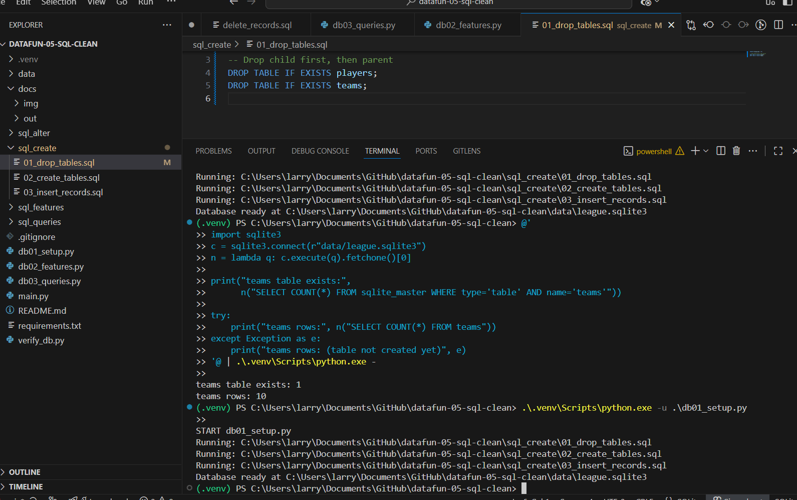
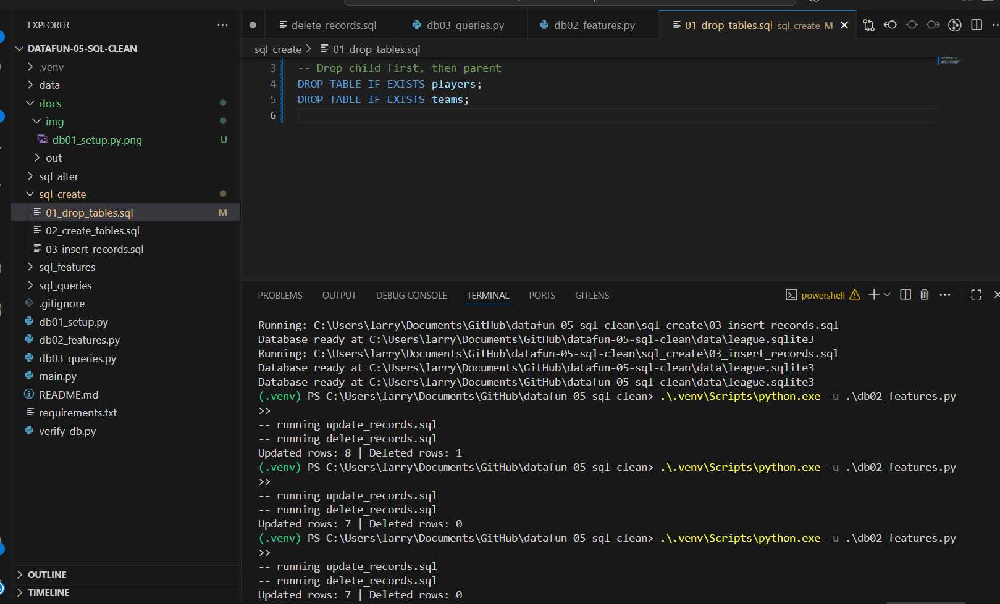
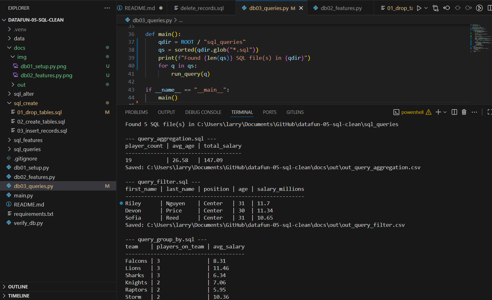

# DataFun-05-SQL: Teams → Players

This project demonstrates using **Python + SQLite** to create and query a small relational database.  
Model: **Teams (parent) → Players (child)** with a 1→N relationship.

---

## Step 1 — Clone the repository (Windows 11)

```powershell
git clone https://github.com/larrygold18/datafun-05-sql.git
cd datafun-05-sql
```
# 2) Create & activate venv
py -m venv .venv
Set-ExecutionPolicy -Scope Process -ExecutionPolicy Bypass
.\.venv\Scripts\Activate.ps1

# 3) Install dependencies
pip install -r requirements.txt

# 4) Build DB (drop → create → insert)
py db01_setup.py

# 5) Run features (update/delete demos)
py db02_features.py

# 6) Run queries (aggregation, filter, sort, group-by, join)
py db03_queries.py
```
## Schema Design
```
**Entities**
- **teams**  
  - `id` TEXT PRIMARY KEY  
  - `name` TEXT NOT NULL  
  - `city` TEXT NOT NULL  
  - `founded_year` INTEGER
- **players**  
  - `id` TEXT PRIMARY KEY  
  - `team_id` TEXT NOT NULL (FK → `teams.id`)  
  - `first_name` TEXT NOT NULL  
  - `last_name` TEXT NOT NULL  
  - `position` TEXT  
  - `age` INTEGER  
  - `salary_millions` REAL

**Relationship**
- One **team** has many **players** (1→N) via `players.team_id`.  
- Foreign keys are enforced with `PRAGMA foreign_keys = ON` and `ON DELETE CASCADE`.

**Initialization order (in `sql_create/`):**
1. `01_drop_tables.sql`
2. `02_create_tables.sql`
3. `03_insert_records.sql`

`db01_setup.py` runs those scripts in order to (re)build the database at `data/league.sqlite3`.
**Features (Step 5)**
- `sql_features/update_records.sql` – updates a few player fields (e.g., salary)  
- `sql_features/delete_records.sql` – deletes one player by last name  
- `db02_features.py` runs both scripts and prints updated/deleted row counts
- ```
## Aggregations & Queries (results)

Below are sample outputs from my SQL queries:

```text
--- query_group_by.sql ---
team            | players_on_team | avg_salary
----------------------------------------------
Falcons         | 3               | 7.96
Lions           | 3               | 10.65
Sharks          | 3               | 6.66
Knights         | 2               | 6.68
Raptors         | 2               | 5.95
…

--- query_join.sql ---
team             | player            | position | age | salary_millions
------------------------------------------------------------------------
Sacramento Kings | Omar Singh        | Center   | 27  | 6.8
San Jose Sharks  | Kai Ishikawa      | Forward  | 25  | 5.2
San Jose Sharks  | Leo Martins       | Center   | 28  | 8.29
Seattle Storm    | Sofia Reed        | Center   | 31  | 9.66
Seattle Storm    | Zane Garcia       | Guard    | 29  | 9.13
…

--- query_sorting.sql ---
name    | city       | founded_year
-----------------------------------
Tigers  | Detroit    | 1934
Bulls   | Chicago    | 1966
Falcons | Atlanta    | 1975
Lions   | Dallas     | 1980
Kings   | Sacramento | 1985
…
```
## Project Structure
```
datafun-05-sql/
├─ data/
│ └─ league.sqlite3
├─ sql_create/
│ ├─ 01_drop_tables.sql
│ ├─ 02_create_tables.sql
│ └─ 03_insert_records.sql
├─ sql_features/
│ ├─ update_records.sql
│ └─ delete_records.sql
├─ sql_queries/
│ ├─ query_aggregation.sql
│ ├─ query_filter.sql
│ ├─ query_sorting.sql
│ ├─ query_group_by.sql
│ └─ query_join.sql
├─ db01_setup.py
├─ db02_features.py
├─ db03_queries.py
└─ README.md
```
## Screenshots (Verification)

### 1) `db01_setup.py` — Database initialized
Shows the run order (**01_drop_tables.sql → 02_create_tables.sql → 03_insert_records.sql**) and the success line.

**What to capture:** the three “Running:” lines and the success line (e.g., `✔ Database initialized: data/league.sqlite3` or `Database ready at ...`).

**Setup output:**



---

### 2) `db02_features.py` — Updates/Deletes applied
Confirms feature scripts executed (updates and delete) and reports row counts.

**What to capture:** “-- running update_records.sql”, “-- running delete_records.sql”, and the final counts (e.g., `Updated rows: X`, `Deleted rows: Y`).

**Features output:**



---

### 3) `db03_queries.py` — Joins / Aggregations / CSVs
Displays the results of join/group-by/sorting queries and prints CSV save confirmations (`Saved: out_*.csv`).

**What to capture:** one or two printed tables (e.g., from `query_join.sql` and/or `query_group_by.sql`) **and** the “Saved: out_*.csv” lines.

**Queries output:**


